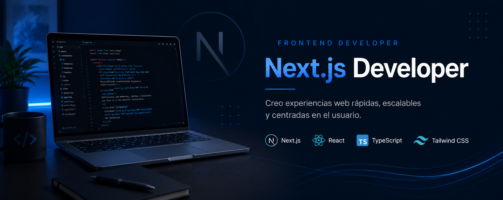

  

# Hola, soy Axel 

## Desarrollador Front-End con experiencia también en Back-End

💻 Especializado en:
- Next.js
- React
- TypeScript
- JavaScript
- Nest.js

🚀 Interesado en:
- Inteligencia Artificial
- Desarrollo Web
- Startups Tecnológicas

## Tecnologías

## Educación y experiencia

Me formé en el Bootcamp Henry, donde participé en el desarrollo de soluciones web colaborativas, incluyendo un e-commerce y una plataforma/sistema operativo para una empresa real que ofrece cursos a medida. Además, desarrollé de manera independiente un sitio web para la publicación y comercialización de embarcaciones, integrando contacto directo con clientes a través de WhatsApp y una aplicación orientada a monotributistas argentinos para la creación de Facturas C mediante comandos de voz, combinando desarrollo web e inteligencia artificial.

## Repositorios

- Sitio web de embarcaciones: https://github.com/axelaranda/ParanaBoats
- E-commerce del Bootcamp: https://github.com/axelaranda/E-comm
- Front de plataforma para empresa real desarrollada en el Bootcamp: https://github.com/axelaranda/Viacore-front
- Back de plataforma para empresa real desarrollada en el Bootcamp: https://github.com/axelaranda/Viacore-back

## Contacto

- LinkedIn: www.linkedin.com/in/axel-aranda
- Email: axelemilianoaranda1993@gmail.com
- Phone: 54 3435032200
